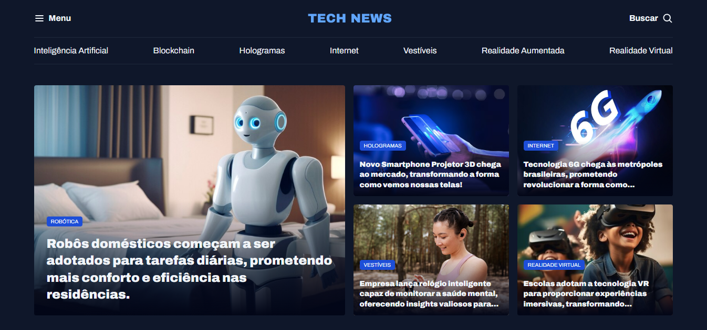

<p align="center">
  <a href="#-tecnologias">Tecnologias</a>&nbsp;&nbsp;&nbsp;|&nbsp;&nbsp;&nbsp;
  <a href="#-projeto">Projeto</a>&nbsp;&nbsp;&nbsp;|&nbsp;&nbsp;&nbsp;
  <a href="#-layout">Layout</a>&nbsp;&nbsp;&nbsp;|&nbsp;&nbsp;&nbsp;
  <a href="#-licença">Licença</a>
</p>

<p align="center">
  
  
</p>

<br>

<p align="center">
  
</p>

## 🚀 Tecnologias

Esse projeto foi desenvolvido com as seguintes tecnologias:

- HTML
- CSS

### Bibliotecas

- [Google Fonts](https://fonts.google.com/)


### Conceitos aplicados

- Estruturação semântica de documentos HTML
- Estilização de layout com CSS3
- Manipulação imagens
- Aplicação cores, background e tipografia
- Variávies CSS
- Flexbox e alinhamentos
- Grid Layout:
    - Grid Template, grid-template-columns, grid-template-areas...
- Criação de classes utilitarias:
    - grid, grid-col, gap-16, gap-32, text-2xl, text-xl...
- CSS nesting

## 💻 Projeto

**Portal de notícias | Tech News**, para apaixonados por tecnologia e novidades do mundo tech.

Exemplo: Desenvolvido com foco em interface, a página web representa uma sistema de portal de notícias para os usuários ficar por dentro do que rola no mundo tech. Proposta, trazer armonia e organização de layout mais complexo.

### Como rodar o projeto

1. **Pré-requisitos:**
   - Ter o Git instalado e configurado.
2. **Clone o repositório:**
   ```bash
   git clone https://github.com/luizfpinto94/portal-de-noticiais.git
3. **Acesse a pasta do projeto:**
   ```bash
   cd portal-de-noticiais
4. **Abra o editor de código (Ex: Vscode):**
   Instale o plugin Live Server e abra o projeto no navegador
   
## 🎨 Layout

Você pode visualizar o layout do projeto através [desse link](https://www.figma.com/community/file/1362166020452569562/portal-de-noticias).
É necessário ter conta no [Figma](https://figma.com) para acessá-lo.

## 📝 Licença

Esse projeto está sob a licença MIT. Veja o arquivo [LICENSE](LICENSE) para mais detalhes.

---

